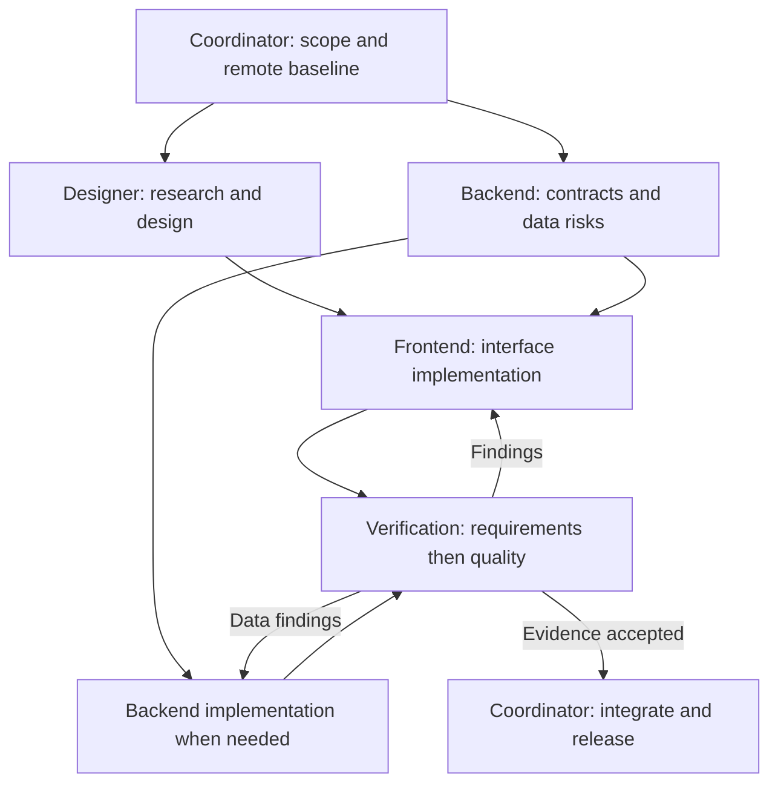

# Magni engineering team

This is the reusable team for Magni work. Project-scoped roles live in `.codex/agents/`. Ask the coordinator to use the Magni team for a task; it supplies the relevant role instructions and records handoffs here and in the task's implementation plan. If the client cannot select a custom role directly, the coordinator reads that role's file and supplies its instructions to a normal subagent.

The definitions persist in Git. Agent processes run on demand; they are not always-on background services. Completed tasks, decisions and verification evidence are the durable shared memory. No model or permission overrides are required.

## Roles

| Agent | Responsibility | Handoff |
| --- | --- | --- |
| `magni_coordinator` | Scope, latest remote baseline, dependency graph, file ownership, integration and release | Task plan with acceptance criteria, assignments, results and remaining gates |
| `magni_designer` | Research relevant primary sources, define hierarchy and responsive/accessibility behaviour, inspect rendered screens | Concise design decisions, direct sources and visual acceptance criteria |
| `magni_frontend` | Implement React UI, interactions and responsive layouts using the design system | Files changed, behaviour preserved, focused tests and screenshots |
| `magni_backend` | Data/API contracts, identities, retries, migrations, progression and history integrity | Contract decisions and tests; explicitly say when no backend change is needed |
| `magni_verification` | Independently check requirements, then code quality and realistic workflows | Reproducible findings or passed gates, commands, screenshots and limits |

## Work graph

Use only the roles needed for a task. Assign disjoint files to concurrent workers. One agent owns a shared browser server, build output or database at a time. Respect the actual concurrency limit; rotate specialists when slots are unavailable. The primary agent may act as coordinator.

## Operating rules

1. Read `AGENTS.md`, `docs/design-system.md` and installed Next.js documentation relevant to changes. Existing user instructions and authorization govern the task.
2. Fetch remote before editing, compare divergence and preserve unrelated/uncommitted work. Never blindly reset or overwrite it.
3. Each assignment identifies outcome, exact file ownership, dependencies, verification and expected handoff. Keep the plan current so a later session can resume.
4. Use disposable data. Preserve workout identity, authored prescriptions, history, progression, revision checks and retry safety. Avoid schema changes for presentation work.
5. Run focused checks during development, then required release checks. Inspect iPhone viewport screenshots for UI work and desktop screenshots for program editing.
6. Verification is independent of implementation. Review requirements first, code quality second, then resolve material findings and rerun affected checks.
7. Only the coordinator handles Git integration and deployment. Never expose secrets, include private data artifacts in commits, or claim a release without traceable evidence.

## Active work

- [2026-09-30 desktop progression workspace](../plans/2026-09-30-desktop-progression-workspace.md): progression setup and faster program building; baseline `be9824d` matches fetched `origin/main`.
- [2026-09-30 design refinement](../plans/2026-09-30-design-refinement.md): five approved improvements; baseline `ed9051f` matches fetched `origin/main`.

## Configuration reference

The project files use the required `name`, `description` and `developer_instructions` fields documented in [Codex custom agents](https://learn.chatgpt.com/docs/agent-configuration/subagents). Models and permissions inherit from the parent session. New sessions discover the saved project roles; an already-running session can explicitly read and delegate from the files.
